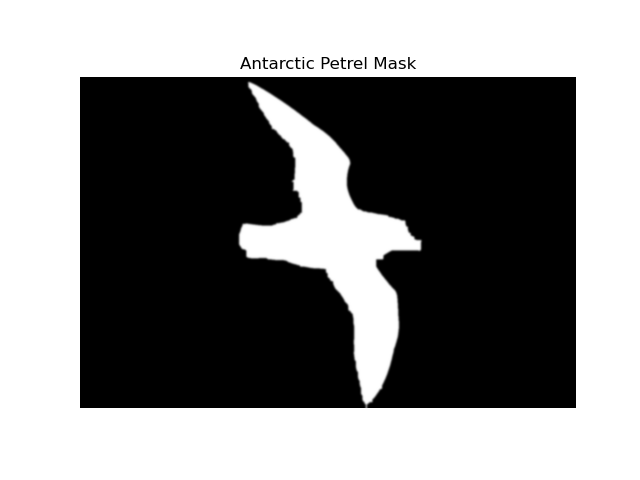
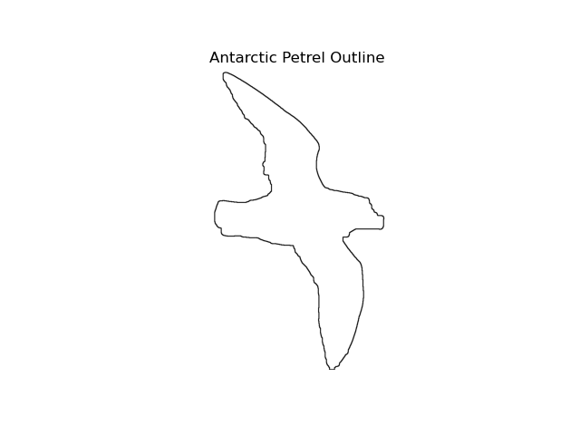

# Kendall's shape space

## David G. Kendall - the man, the myth, the mathematician

For anyone new to the study of shape analysis, I'd like to introduce them to Professor David George Kendall (born 1918 in the UK)--a pioneer in applied probability and statistics, he was actually the first-ever Professor of Mathematical Statistics at Cambridge. He's referred to as the father of modern probability theory in Britain, and contributed to a number of diverse and esoteric applied fields in addition to his mastery of abstract mathematical theory. Kendall was initially interested in pursuing work related to his fascination with stars, becoming set on studying mathematics when he was advised it was a necessary first step to understanding astronomy. 

A fundamental piece in Kendall's growth as a mathematician was his experiences in the Projectile Development Establishment (PDE) in Wales during World War II, where he worked on rocketry. Kendall at the time (~1940) was a relatively new graduate and the team contained more seasoned mathematicians who could relay insights and experience to the younger Kendall. It was during Kendall's time with the PDE that he gained a sudden and deeper understanding of probability and statistics, filling a void left in the PDE when statisticians Frank Anscombe and Maurice Bartlette left for posts in London. Bartlett and Kendall reportedly began focusing on Markov processes governing random time-evolving systems around his time on the PDE project. 

After Kendall's time in the PDE, he was tenured at Magdelen College in Oxford starting in 1946, then in 1952 took on a year-long visiting position at Princeton University. Kendall was later appointed Director of the Statistical Laboratory at Cambridge University, where he was a fellow until his retirement in 1985 and after which was allowed to be a life fellow and contribute to academia for the rest of his life. Kendall passed away in 2007. He has been awarded the Guy Medal in silver and gold from the Royal Statistical Society (1955 and 1980), the Senior Whitehead Prize from the London Mathematical Society (1980), and the De Morgan Medal from the London Mathematical Society (1989). He was a fellow of the Royal Society from 1964 until his death and helped found the Bernoulli Society in 1975. 

Some of Kendall's most prominent works include his contributions to the understanding of stochastic processes and queueing theory; for example, there is a "Kendall notation" and for queues and imbedded Markov chain method introduced in his 1953 paper "Stochastic processes occurring in the theory of queues and their analysis by the method of the imbedded Markov chain". The A/S/c (for Arrival/Service/Servers) notation for describing queue types is still referred to as Kendall's notation. Kendall also developed early formal work in random sets, geometric probability, and spatial point processes, applying these concepts to models of river networks, biological shape, and topographic features. Out of this, Kendall became a pioneer in the modeling of spatial randomness, which is now key to geostatistics and ecology. A surprising outcome of Kendall's work was his debunking of some theories about ley lines; in his 1989 paper "Ley lines in question", Kendall showed how alignments of three or more points can arise purely by chance, meaning the appearance of ley lines in geographic data (like monument maps) doesn't inherently imply any meaningful pattern or intention. Now a classic example of mathematical rigor being used to debunk pseudoscientific claims, Kendall proposed quantitative tests for assessing whether alignments are statistically significant or not. I highly recommend reading the biography "David George Kendall" by Sir John Kingman FRS for more information on Kendall's early life and well known works (see [here](https://royalsocietypublishing.org/doi/10.1098/rsbm.2008.0017)); for now I'll turn the focus to Kendall's contributions to shape analysis. 

## Shape spaces 
I feel a good start to understanding shape in a mathematical way is to start with Kendall's framework (and any of my own personal interest in Kendall's life is mere coincidence...). I find that Kendall's formalization of shapes is intuitive even to the not-mathematically-inclined. We can think of a shape as a form or outline of an object--try to imagine the outline of a bird (an Antarctic petrel to be exact), for example:

